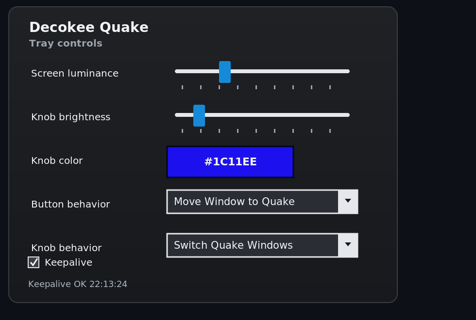

# Decokee Quake Tools

Small Windows utilities for the Decokee Quake desktop device.

The goal is to replace the vendor always-on companion app with a minimal,
local-first toolchain that keeps the device display alive and exposes useful
hardware controls without requiring administrator privileges or network access.



## Applications

| Path | Description |
|---|---|
| `apps/decokee-keeper/` | Command-line HID probe and keeper utility |
| `apps/decokee-tray/` | Windows tray companion app |
| `wiki/` | Project notes and hardware research |

## Features

- HID device discovery and report logging.
- Display keepalive for the Quake transparent monitor mode.
- Screen luminance and knob RGB matrix controls.
- Rotary knob window switching on the Quake display.
- Optional knob modes for Quake luminance and system volume.
- Button actions for focusing or moving windows to the Quake display.
- No internet communication.
- No administrator privilege requirement.
- No vendor runtime dependency.

## Requirements

- Windows
- .NET 10 SDK
- Decokee Quake device connected over USB

## Build

```bash
dotnet build Decokee.slnx
```

## Tray App

From Windows PowerShell:

```powershell
dotnet run --project .\apps\decokee-tray
```

The app starts as a tray icon. Left click opens the settings popup. Right click
opens a minimal context menu with keepalive and exit actions.

By default, the app:

- starts the display keepalive loop,
- applies the configured screen luminance,
- disables the pulsing A3 knob LED,
- applies the configured QMK RGB matrix color and brightness.

## Keeper CLI

```powershell
dotnet run --project .\apps\decokee-keeper -- list
dotnet run --project .\apps\decokee-keeper -- listen --count 10
dotnet run --project .\apps\decokee-keeper -- keepalive --path-contains mi_02
```

See `apps/decokee-keeper/README.md` for lower-level probing commands.

## License

MIT
